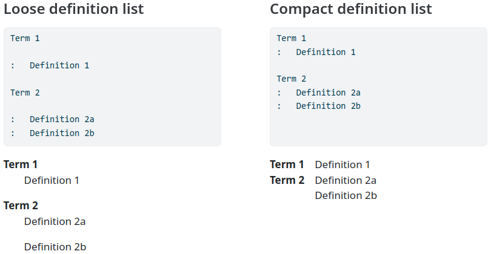

# Compact Definition List Extension



The description of Pandoc's [definition lists](https://pandoc.org/MANUAL.html#definition-lists) says

> If you leave space before the definition […], the text of the definition will be treated as a paragraph. In some output formats, this will mean greater spacing between term/definition pairs. For a more compact definition list, omit the space before the definition

Strictly speaking, this only defines "compact definitions".

This extension defines a "compact definition list" as a definition list which contains exclusively "compact definitions". Such a list is wrapped in a `div` with class `compactdef`, and CSS is applied which gives such lists a compact table-like formatting in HTML-based output formats.

The CSS also indents definitions in loose lists.

## Installing

```bash
quarto add allefeld/quarto-stuff/compactdef
```

## Using

```yaml
filters:
  - compactdef
```

## Example

Source code for a minimal example: [example.qmd](example.qmd).
